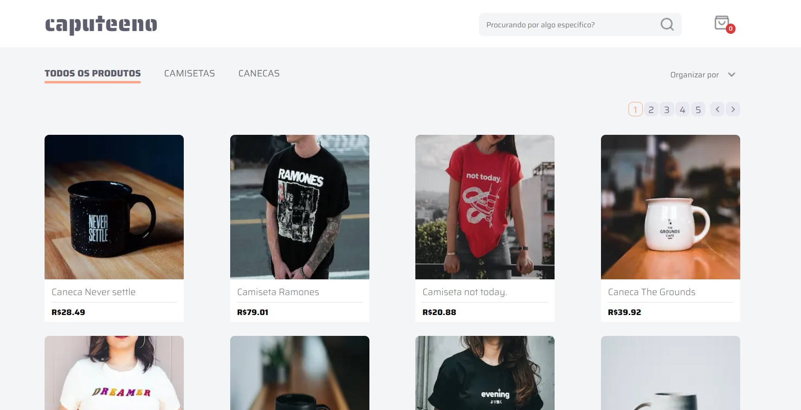
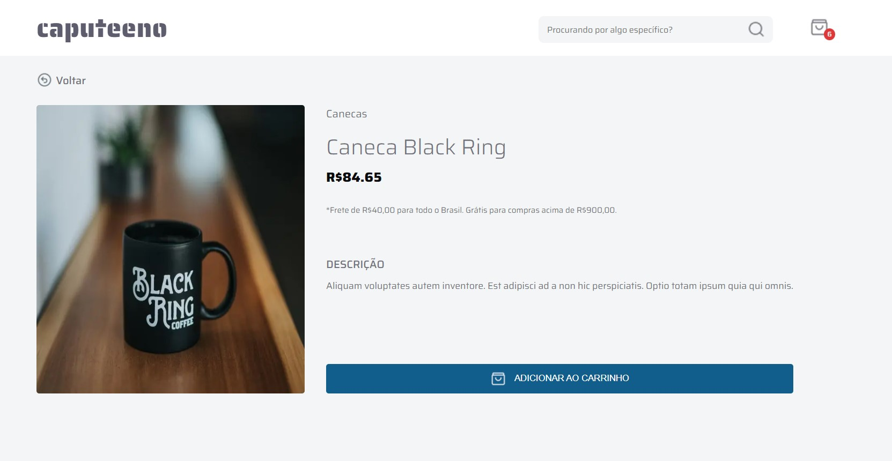
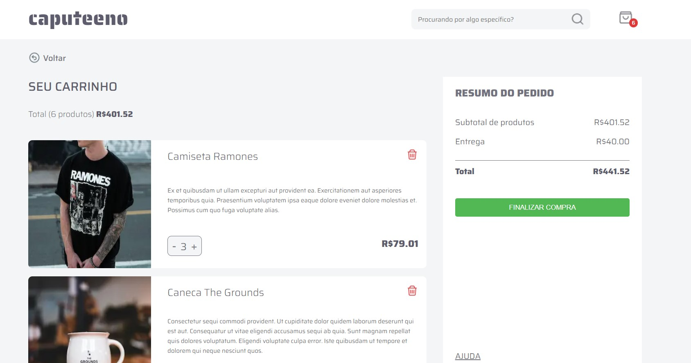

# 🚀 Caputeeno Challenge

O desafio desse projeto foi implementar um e-commerce para venda de canecas e camisetas que deveria ter as seguintes funcionalidades:
- [ x ] Catálogo de produtos com paginação
- [ x ] Filtragem produtos por categoria
- [ x ] Busca por nome do produto
- [ x ] Adicionar e remover produtos do carrinho
- [ x ] Finalizar compra



- Segui [o protótipo](https://www.figma.com/file/rET9F2CeUEJdiVN7JRu993/E-commerce---capputeeno?node-id=680%3A6449)
- Utilizei Next.js e Typescript
- A estilização foi feita com styled-components
- Utilizei o local storage para gerenciar o carrinho
- Voce encontrará o passo a passo para instalação do projeto logo abaixo
- Consumi a **API GraphQL** disponibilizada pela Rocketseat



Além dos requisitos levantados acima, dei bastante atenção a alguma coisas extras durante a correção do desafio:

- Gerenciamento de estado
- Componentização
- Responsividade
- Preocupação com usabilidade
- Preocupação com acessibilidade
- Padrões de código
- Padrão de commits (_Conventional_)

## ☑️ Para rodar você precisará:

 + Editor de código de sua preferência (recomendado VS code)
 + Git
 + Gerenciador de pacotes Yarn ou NPM

## 📝 Procedimentos de instalação

Clone este repositório usando o comando:

```
git clone https://github.com/TurinoS/Caputeeno-Challenge
```

Na pasta do projeto instale as dependências com uso do npm ou yarn

```
npm install

ou

yarn install
```
Em um terminal acesse a pasta caputeeno e inicie o servidor com os comandos:

```
cd caputeeno
npm run dev

ou

cd caputeeno
yarn dev
```

Em outro terminal acesse a pasta api e inicie o servidor com os comandos:

```
cd api
npm start

ou

cd api
yarn start
```

## 😎 Minhas redes

+ Linkedin - [paulo-turino](https://www.linkedin.com/in/paulo-turino/)
+ Instagram - [@paulo_turino](https://www.instagram.com/paulo_turino/)
+ GitHub - [TurinoS](https://github.com/TurinoS)
